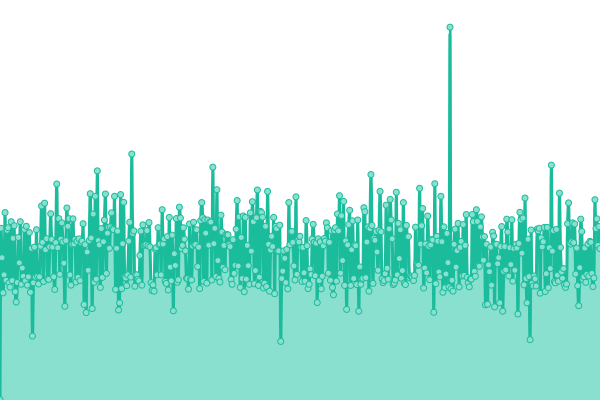
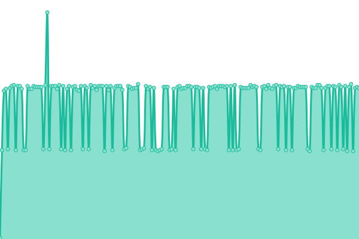
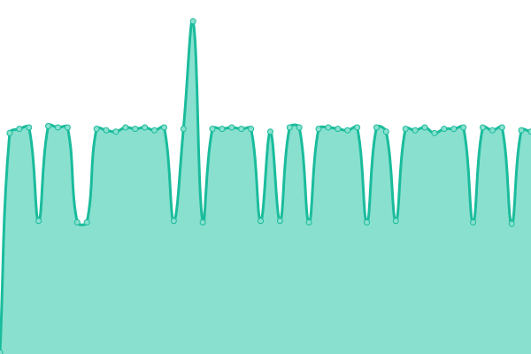

# [📈 Status Actuel](https://status.earthnetwork.fr): <!--live status--> **🟥 Complete outage**

This repository contains the open-source uptime monitor and status page for [EarthNetwork](https://earthnetwork.fr), powered by [Upptime](https://github.com/upptime/upptime).

With [Upptime](https://upptime.js.org), you can get your own unlimited and free uptime monitor and status page, powered entirely by a GitHub repository. We use [Issues](https://github.com/earthnetwork/status/issues) as incident reports, [Actions](https://github.com/earthnetwork/status/actions) as uptime monitors, and [Pages](https://status.earthnetwork.fr) for the status page.

## [📈 Live Status](https://demo.upptime.js.org): <!--live status--> **🟥 Complete outage**

<!--start: status pages-->
<!-- This summary is generated by Upptime (https://github.com/upptime/upptime) -->
<!-- Do not edit this manually, your changes will be overwritten -->
<!-- prettier-ignore -->
| URL | Status | History | Response Time | Uptime |
| --- | ------ | ------- | ------------- | ------ |
|  [Site internet](https://earthnetwork.fr) | Down | [site-internet.yml](https://github.com/EarthNetwork/status/commits/HEAD/history/site-internet.yml) | 

 0ms
     
 | 

<a href="https://status.earthnetwork.fr/history/site-internet">0.00%</a>
    

|  Serveur Mail | Down | [serveur-mail.yml](https://github.com/EarthNetwork/status/commits/HEAD/history/serveur-mail.yml) | 

 0ms
     
 | 

<a href="https://status.earthnetwork.fr/history/serveur-mail">0.00%</a>
    

|  Serveur votes | Down | [serveur-votes.yml](https://github.com/EarthNetwork/status/commits/HEAD/history/serveur-votes.yml) | 

 0ms
     
 | 

<a href="https://status.earthnetwork.fr/history/serveur-votes">0.00%</a>
    

|  Proxy Waterfall (bungee) | Down | [proxy-waterfall-bungee.yml](https://github.com/EarthNetwork/status/commits/HEAD/history/proxy-waterfall-bungee.yml) | 

 0ms
     
 | 

<a href="https://status.earthnetwork.fr/history/proxy-waterfall-bungee">0.00%</a>
    

<!--end: status pages-->

[**Visit our status website →**](https://status.earthnetwork.fr)

## 📄 License

- Powered by: [Upptime](https://github.com/upptime/upptime)
- Code: [MIT](./LICENSE) © [EarthNetwork](https://earthnetwork.fr)
- Data in the `./history` directory: [Open Database License](https://opendatacommons.org/licenses/odbl/1-0/)
